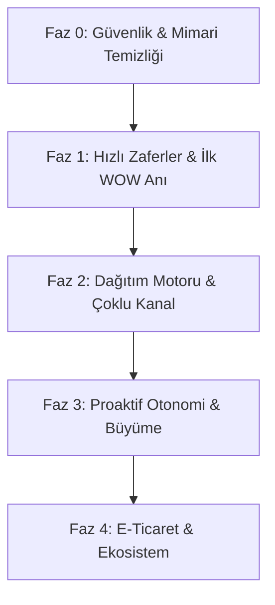

# Tentamark AI Marketing Manager — Stratejik Master Plan & Yol Haritası

> **Vizyon:** Tentamark'ı yalnızca gönderi zamanlayan klasik bir "Sosyal Medya Aracı" olmaktan çıkarıp, pazarlama ekibi olmayan bir işletmeye 7/24 çalışan **kıdemli bir AI Pazarlama Direktörü (Autonomous AI Marketing Director)** deneyimi sunmak.

---

## 🧭 Mimari Mantık: Neden Bu Sıralama?

Bir özelliği havada tek başına geliştirmek teknik borç yaratır. Bu yol haritası **"Bağımlılık Zinciri" (Dependency Chain)** prensibiyle tasarlandı:

- **Önce Güvenlik & ComposeForm Refactor:** Dev bileşen (2.175 satır) parçalanmadan içine *Caption Lab* veya *1→7 Multiplier* eklenemez.
- **Sonra Hızlı AI Dokunuşları (Caption Lab & Sektör DNA):** Kod tabanındaki mevcut AI modülleri ([analyzePostHookAndVirality.ts](file:///d:/marketing-project/web/src/lib/ai/analyzePostHookAndVirality.ts), [getBrandVoiceConsistency.ts](file:///d:/marketing-project/web/src/lib/ai/getBrandVoiceConsistency.ts)) doğrudan arayüze bağlanarak kullanıcıya anında "Bunu başka hiçbir araçta görmedim" dedirtir.
- **Sonra Dağıtım (Publisher & LinkedIn):** İçerik üretimi mükemmelleştikten sonra gerçek sosyal ağlara hatasız basılır.
- **En Son Otonomi (Autopilot & Radar):** Temel sağlam olunca AI artık kullanıcının arkasından iş toplayan değil, haftalık planı önden hazırlayan bir asistana dönüşür.

---

## 🚀 FAZ 0: Temel Sağlamlaştırma & Emniyet Kemerleri (Sprint 1)
*Hedef: Güvenlik açıklarını kapatmak, veri kaybını önlemek ve yeni özelliklerin ekleneceği zemini hazırlamak.*

### 0.1 Auth Middleware & Route Koruması
- **Mevcut Durum:** [middleware.ts](file:///d:/marketing-project/web/src/middleware.ts) yalnızca `www` yönlendirmesi yapıyor; `/dashboard/*` rotaları Supabase SSR session kontrolüne sahip değil.
- **Ne Yapılacak:** Supabase SSR auth kontrolü ve token refresh zinciri eklenecek. Giriş yapmamış istekler doğrudan login'e yönlendirilecek.
- **Neden İlk Sırada:** Güvenlik açığı olan bir sisteme yeni kullanıcı ve özellik getirilemez.

### 0.2 ComposeForm.tsx Modülerleştirme (Refactor)
- **Mevcut Durum:** [ComposeForm.tsx](file:///d:/marketing-project/web/src/components/dashboard/ComposeForm.tsx) 2.175 satırlık tek bir monolit.
- **Ne Yapılacak:** Mantıksal parçalara ayrılacak:
  - `ComposeHeader` (Marka seçimi, taslak durumu)
  - `ComposePlatformBar` (Platform hedefleri)
  - `ComposeEditor` (Metin editörü, hook skorlayıcı)
  - `ComposeMediaUploader` (Görsel/video/kütüphane)
  - `ComposeAIAssistant` (Caption Lab, ton seçici)
  - `ComposeScheduler` (Tarih, saat, en iyi zaman)
  - `ComposePreviewPanel` (Canlı platform önizlemesi)
- **Neden Bu Sırada:** Sonraki fazlarda eklenecek olan *Caption Lab* ve *1→7 Multiplier* bu bileşenin içine entegre olacak. Parçalanmazsa kod kilitlenir.

### 0.3 Draft Autosave & Global Error Boundary
- **Ne Yapılacak:** 
  - ComposeForm'da yazılan metin ve ayarlar her 3 saniyede `localStorage` / taslak tablosuna otomatik kaydedilecek. Sayfa yenilense bile veri kaybolmayacak.
  - Dashboard köküne bir React Error Boundary eklenecek; bir AI hatası durumunda tüm sayfa beyaz ekrana düşmeyecek.
- **Sağladığı Fayda:** Kullanıcının emeği korunur, güvenilirlik artar.

---

## 💎 FAZ 1: İlk "Aha Moment" & WOW Etkisi (Sprint 2)
*Hedef: Kullanıcının kayıt olduğu ilk 5 dakikada rakiplerden (SocialBee, Planable) farkı hissetmesi.*

### 1.1 🎯 Sektör DNA (Akıllı Başlangıç Paketleri)
- **Ne Yapılacak:** Kullanıcı kaydolup sektörünü seçtiğinde (ör. Butik Kafe, Kuaför/Güzellik, Hukuk Bürosu, E-Ticaret):
  - 1 aylık hazır içerik takvimi şablonu otomatik yüklenir.
  - Sektöre özel 50+ hashtag bankası ve en aktif saatler tanımlanır.
  - AI Assistant o sektörün jargonu ve dinamiklerine göre konuşmaya başlar.
- **Neden Burada Yapılmalı:** Kapsamlı bir Onboarding akışı kodlamadan önce, kullanıcının "boş dashboard" sendromunu tek hamlede çözer.
- **Niş Farkı:** Rakipler boş takvim verir ve kullanıcının içerik girmesini bekler. Tentamark ilk saniyede takvimi doldurur.

### 1.2 🧪 Caption Lab (A/B Kanca & Skorlama Motoru)
- **Ne Yapılacak:** [ComposeForm](file:///d:/marketing-project/web/src/components/dashboard/ComposeForm.tsx) içine 3 farklı varyant motoru bağlanır:
  1. *Merak Kancası (Curiosity Hook)* — %92 Puan
  2. *Eğitici & Bilgilendirici (Value/Educational)* — %84 Puan
  3. *Doğrudan Satış / Eylem (Direct CTA)* — %75 Puan
  - Her varyant için: Hook Gücü, CTA Netliği ve Marka Uyumu skorlanır.
- **Neden Kolay & Etkili:** [analyzePostHookAndVirality.ts](file:///d:/marketing-project/web/src/lib/ai/analyzePostHookAndVirality.ts) zaten yazılmış durumda; sadece Compose ekranına UI kartı olarak bağlanacak.
- **Niş Farkı:** Kullanıcı rastgele metin yazmaz; veriye dayalı en güçlü caption'ı tek tıkla seçer.

### 1.3 🛡️ AI Brand Guardian (Marka Emniyet Kemeri)
- **Ne Yapılacak:** Gönderi planlanmadan veya yayınlanmadan önce sessiz bir AI denetimi:
  - Markanın yasaklı kelimeleri (Brand DNA) taranır.
  - Ton tutarlılığı ölçülür ([getBrandVoiceConsistency.ts](file:///d:/marketing-project/web/src/lib/ai/getBrandVoiceConsistency.ts)).
  - Uyumsuzluk varsa kullanıcıya yapıcı düzeltme önerisi sunulur.
- **Sağladığı Fayda:** Özellikle ekipler ve ajanslar için marka itibarını garanti altına alır.

---

## ⚡ FAZ 2: Dağıtım Motoru & Çoklu Kanal (Sprint 3-4)
*Hedef: İçerik üretiminden sonra gerçek dünyaya kusursuz dağıtım sağlamak.*

### 2.1 Gerçek Publisher Entegrasyonu
- **Mevcut Durum:** [schema.sql](file:///d:/marketing-project/supabase/schema.sql)'daki `process_publish_queue()` mock modda çalışıyor.
- **Ne Yapılacak:** Kuyruktan çekilen postlar [instagramProvider.ts](file:///d:/marketing-project/web/src/lib/social/instagramProvider.ts), [metaProvider.ts](file:///d:/marketing-project/web/src/lib/social/metaProvider.ts) ve diğer provider'ların `.publish()` fonksiyonuna bağlanacak.
- **Neden Bu Sırada:** Faz 1'de üretilen kaliteli içeriklerin artık canlı sosyal ağlara basılması gerekir.

### 2.2 LinkedIn Connector (Eksik MVP P0)
- **Ne Yapılacak:** [registry.ts](file:///d:/marketing-project/web/src/lib/social/registry.ts) içine LinkedIn OAuth ve Post paylaşım provider'ı yazılacak.
- **Neden Kritik:** B2B kullanıcılar, ajanslar ve kurumsal markalar için LinkedIn olmadan ürün eksik kalır.

### 2.3 🎬 1→7 Content Multiplier (İçerik Çarpanı)
- **Ne Yapılacak:** Tek bir girdi (bir blog linki, bir video veya tek bir metin taslağı) verildiğinde AI bunu 7 farklı formatta üretir:
  1. *Instagram Carousel (5 slide metni)*
  2. *Instagram Reel Scripti (Görsel ve ses yönlendirmeli)*
  3. *LinkedIn Postu (İçgörü ve profesyonel üslup)*
  4. *Twitter/X veya Threads dizisi (Punchy ve kısa)*
  5. *TikTok Açıklaması & Kanca*
  6. *Story Serisi (3-5 kartlık kurgu)*
  7. *Facebook Topluluk Postu*
- **Neden Burada Yapılmalı:** ComposeForm parçalandığı ve tüm platform connector'ları hazır olduğu için, üretilen 7 varyant tek tıkla ilgili platformların takvimine dağıtılabilir.
- **Niş Farkı:** SocialBee gibi araçlar aynı metni her yere kopyalar. Tentamark her platformun ruhuna göre yeniden yazar.

---

## 🧠 FAZ 3: Proaktif Otonomi & Büyüme (Sprint 5-6)
*Hedef: Kullanıcının sisteme her gün girmesine gerek kalmadan hesabını büyütmesi.*

### 3.1 🤖 Content Autopilot (Haftalık Otonom Plan)
- **Nasıl Çalışır:**
  - Sistem Pazar gecesi Brand DNA ve Sektör DNA'sından beslenerek 7 günlük planı hazır eder.
  - Pazartesi sabahı kullanıcıya bildirim/e-posta gider: *"Bu haftanın 7 içeriği hazırlandı, 60 saniyede göz atıp onaylar mısın?"*
  - Kullanıcı toplu onaylar veya tek tıkla düzenler.
- **Neden Dönüm Noktası:** Kullanıcı içerik üreticisi olmaktan çıkıp **onay makamı (editor-in-chief)** haline gelir.

### 3.2 📈 Growth Radar & Viral DNA Analizi
- **Ne Yapılacak:**
  - **Growth Radar:** *"Carousel gönderilerin bu hafta tek görsellere göre %240 daha çok kaydedildi. Bu hafta 2 carousel daha üretmek ister misin?"* şeklinde doğrudan aksiyon butonlu öneri kartları.
  - **Viral DNA:** Çok etkileşim alan bir post olduğunda AI neden tuttuğunu analiz eder (Kanca tipi, saat, format) ve *"Bu formülle 3 yeni post üret"* butonu sunar.

### 3.3 📊 Haftalık CEO Raporu (Automated Weekly Digest)
- **Ne Yapılacak:** [getDashboardBriefing.ts](file:///d:/marketing-project/web/src/lib/ai/getDashboardBriefing.ts) modülü genişletilerek her Pazartesi sabahı kullanıcıya tek sayfalık PDF veya e-posta raporu iletilir:
  - Yayınlanan içerik sayısı, tahmini erişim, en başarılı post ve gelecek hafta için 3 AI tavsiyesi.
- **Sağladığı Fayda:** Kullanıcı panele girmese bile Tentamark'ın değer yarattığını her hafta hatırlar (Churn oranını düşürür).

---

## 🛒 FAZ 4: Ticaret & Ekosistem (İleri Aşama)
*Hedef: Ajanslar, e-ticaret siteleri ve yerel işletmeler için vazgeçilmez olmak.*

### 4.1 E-Ticaret Köprüsü (WooCommerce & Shopify)
- Yeni ürün eklendiğinde otomatik lansman serisi (Teaser Story → Lansman Carousel → Müşteri Yorumları → Stok Azaldı).
- Stok azaldığında veya tükendiğinde otomatik "Son Adetler" / "Tükendi" hikayeleri.

### 4.2 💬 Inbox AI (DM & Yorum Asistanı)
- Gelen müşteri sorularına ve yorumlarına marka tonunda 30 saniyede hazır cevap taslağı.
- Sık sorulan sorular için otomatik FAQ kütüphanesi.

### 4.3 🇹🇷 Türkiye Özel Günler & Sezonsal Takvim
- Bayramlar, 29 Ekim, Anneler Günü, Okul Açılışı, Düğün Sezonu gibi dönemsel kampanyalar 14 gün öncesinden takvimde hazır şablon olarak belirir.

---

## 📊 Rakiplerle Karşılaştırma Matrisi

| Kabiliyet | Tentamark (Hedeflenen) | SocialBee | Sprout Social | Planable |
| :--- | :---: | :---: | :---: | :---: |
| **Fiyat Segmenti** | Erişilebilir KOBİ / SaaS | $29 - $179 | $79 - $399+ | $39 - Custom |
| **Sektör DNA (Hazır Şablon & Mentor)** | ✅ **Derin & Otomatik** | ❌ Sadece Genel Kategori | ❌ Yok | ❌ Yok |
| **Caption Lab (A/B Skorlama)** | ✅ **Var (Dahili)** | ❌ Yok | ❌ Yok | ❌ Yok |
| **1→7 Çoklu Platform Çevirici** | ✅ **Platforma Özel Yeniden Yazım** | 🟡 Sadece Metin Kopyalama | 🟡 Manuel Düzenleme | ❌ Yok |
| **Proaktif Autopilot (Onay Odaklı)** | ✅ **Var** | ❌ Kullanıcı Üretimi Bekler | ❌ Yok | ❌ Yok |
| **AI Brand Guardian (Güvenlik/Ton)** | ✅ **Var** | ❌ Yok | 🟡 Kurumsal Planlarda | ❌ Yok |
| **Türkçe Dil & Yerel Sezon Zekası** | ✅ **%100 Optimize** | ❌ Yüzeysel | ❌ Yok | ❌ Yok |

---

## 🎯 Başlangıç İçin İlk 3 Somut Adım (Next Actions)

Hemen aksiyon almak için şu sırayla ilerliyoruz:

1. **Adım 1:** [middleware.ts](file:///d:/marketing-project/web/src/middleware.ts) dosyasında Supabase SSR auth kontrolünü aktifleştirerek dashboard rotalarını koruma altına almak.
2. **Adım 2:** [ComposeForm.tsx](file:///d:/marketing-project/web/src/components/dashboard/ComposeForm.tsx) dosyasını temiz ve bakımı kolay alt bileşenlere bölmek + Draft Autosave eklemek.
3. **Adım 3:** Mevcut [analyzePostHookAndVirality.ts](file:///d:/marketing-project/web/src/lib/ai/analyzePostHookAndVirality.ts) fonksiyonunu yeni parçalanan Compose ekranına **Caption Lab** bileşeni olarak bağlamak.
